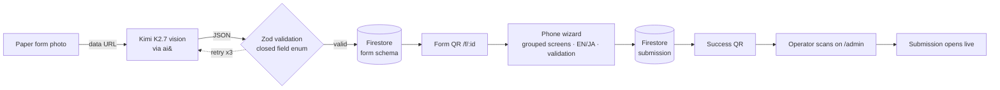

<div align="center">


# Flying Form

**Photograph a paper form; get a working, validated, bilingual mobile form in seconds.**

The visitor fills it on their phone by scanning a QR. The enterprise scans the visitor's success QR back and the exact submission opens on the dashboard. Every model call runs on Kimi K2.7 via ai& inference, in Japan.

[](./LICENSE)


**[Live demo → flying-form-9f6b3.web.app](https://flying-form-9f6b3.web.app)** &nbsp;·&nbsp; open `/admin` to create a form, `/f/:formId` to fill one

Built for the **ai& × Moonshot Tokyo Hackathon Night** — Enterprise Workflow / AI Agent track.

</div>

---

## The problem

Japanese enterprises — property, facilities, clinics, city offices — still run intake on paper. Someone photographs, re-keys, and files each sheet by hand. Building a digital equivalent normally costs a developer days per form, so most forms never get digitized.

Paper also excludes people. A Japanese-only sheet is unusable to the foreign residents and visitors across Tokyo, invisible to a screen reader, and hard for anyone with low vision or a motor barrier. Digitizing the form is not only an efficiency win; it is what makes the form accessible at all.

## What it does

You point a phone at a paper form. Ten seconds later you have a real mobile form: right input type per field, inline validation, an English/Japanese toggle, and a shareable QR. A visitor scans it, fills a clean grouped-screen wizard, and submits. Their phone shows a success QR. You scan that QR at the desk and their submission opens live.

No field setup. No schema editor. One photo in, one working form out.

## Demo flow

Try it live at **[flying-form-9f6b3.web.app](https://flying-form-9f6b3.web.app)**.

1. An operator shoots a paper form on the dashboard. Kimi reads it and a validated mobile form renders in about ten seconds. **This is the value beat.**
2. A visitor scans the form QR on their own phone and fills the grouped wizard, flipping it to English mid-way.
3. On submit, the visitor's phone shows a success QR.
4. The operator scans that QR on the dashboard and the exact submission opens in the table, live.

Two real Japanese forms are included under [`sample-forms/`](./sample-forms) if you want to try the generator without your own paper.

## How it works



**One JSON object flows through the whole system.** Structure is separate from values, so the schema is generated once and every submission is just a `values` map keyed by field id.

### Safety by construction

Kimi can only emit fields whose `type` is one of a closed nine-value enum:

```
text · email · tel · number · date · select · radio · checkbox · textarea
```

Model output is stripped of stray fences, `JSON.parse`d in a try/catch, and validated against a Zod schema before anything renders. Invalid output is rejected and retried up to three times, never displayed. A bad photo cannot produce a broken form — the generator has no vocabulary for one. See [`app/src/lib/types.ts`](./app/src/lib/types.ts).

### Sovereignty

Vision and text both run on **Kimi K2.7 on ai& inference, hosted in Japan**. The browser never calls a foreign model API. A thin Firebase Cloud Function ([`app/functions/index.js`](./app/functions/index.js)) proxies requests to ai& because the endpoint has no CORS; the key stays server-side. Personal data on the form is processed on Japan-based inference rather than shipped abroad.

### Bilingual by default

Kimi emits both `label_en` and `label_ja` for every title, section, field, and option at generation time. The language toggle flips the entire form instantly with no extra model call and without losing entered values.

### Accessibility

The fill surface is a real digital form built on native controls: associated `<label>`s, a semantic `progressbar`, visible focus, `aria-current` on the create-flow stepper, and adequate contrast and tap targets. A screen reader can navigate it; a photo of paper cannot be navigated at all. The English/Japanese toggle is the most concrete inclusion win, and it is a core P0 feature rather than an add-on.

## Quickstart

**Prerequisites:** Node 22+, a Firebase project (Hosting + Firestore), the ai& Cloud Function deployed.

```bash
cd app
npm install
npm run dev          # http://localhost:5173, /api/kimi proxied to the deployed function
```

Open `/admin` to create a form, or `/f/:formId` to fill one.

Firebase config lives in [`app/.env`](./app/.env) as `VITE_FB_*` variables. In dev, [`vite.config.ts`](./app/vite.config.ts) proxies `/api/kimi` to the deployed Cloud Function; in production a Firebase Hosting rewrite points the same path at it.

**Build and deploy:**

```bash
cd app
npm run build        # tsc -b && vite build
firebase deploy      # hosting + the kimi function + Firestore rules
```

## Project structure

```
flying-form/
├── app/                        # the product — a single Vite + React 19 SPA
│   ├── src/
│   │   ├── pages/              # Admin, AdminNew, AdminFormDetail, Fill
│   │   ├── components/         # AdminShell, FormPreview, FieldInput, ShareQR, ScanModal
│   │   └── lib/
│   │       ├── kimi.ts         # ai& calls: schema generation + prefill
│   │       ├── types.ts        # schema, Zod validation, defensive parse
│   │       ├── fb.ts           # Firestore: forms + submissions
│   │       ├── lang.tsx        # EN/JA context
│   │       └── i18n.ts         # UI-chrome strings
│   ├── functions/index.js      # ai& proxy Cloud Function (the deployed one)
│   └── firebase.json           # hosting rewrites, Firestore config
├── sample-forms/               # two real Japanese forms to test the generator
├── PRODUCT.md                  # product brief, positioning, design principles
└── flying-form-prd.md          # full PRD: requirements, data schema, demo script
```

## Tech stack

| Layer | Choice |
|---|---|
| Frontend | React 19, React Router 7, Vite 8, TypeScript 6 |
| AI | Kimi K2.7 on ai& inference (vision + text), the only model |
| Validation | Zod 4 against a closed field-type enum |
| Store | Cloud Firestore (forms + per-form submission subcollections, live listeners) |
| Proxy | Firebase Cloud Function in `asia-northeast1` |
| QR | `qrcode.react` for generation, `html5-qrcode` for scanning |
| Type | Inter Variable |

## Status: what is built

**Done (P0 — the full round trip works end to end):**

- Photo → Kimi vision → validated schema, retried on bad output
- Publish → form URL + QR, with a read-only preview before publishing
- Phone-first grouped wizard: one screen per section, progress bar, back/next, per-section required-field validation
- English/Japanese toggle across the whole fill flow
- Submit → success QR
- Operator scans the success QR on the dashboard → that submission opens
- Live submissions table with per-form counts

**Scaffolded, not wired into the UI:**

- Photo prefill (`prefillValues` in [`kimi.ts`](./app/src/lib/kimi.ts)) — photograph a filled paper copy and map values by field id. The call exists; no screen invokes it yet.

**Not built (design-compatible, parked):** conversational fill, voice fill, WebMCP actuation, pre-submit completeness checks. See the [PRD](./flying-form-prd.md) for the full P1/P2 breakdown.

## Demo-scope and security notes

This is a hackathon prototype. The following are deliberate scoping decisions, not oversights:

- **No authentication.** Every route, including the dashboard, is public. Anyone with a URL or QR can open it. Access control and tenancy are explicitly post-MVP.
- **Demo API key.** The ai& key is committed inline in [`app/functions/index.js`](./app/functions/index.js) as a throwaway key scoped to the event. Rotate or revoke it before any real deployment; move it to a secret manager for production.
- **Open Firestore rules.** [`app/firestore.rules`](./app/firestore.rules) allow open read/write until a hard expiry date — fine for a demo, unsafe for production.

Do not run this as-is with real personal data until auth, secrets management, and Firestore rules are hardened.

## Design docs

- [`PRODUCT.md`](./PRODUCT.md) — positioning, brand, and design principles
- [`flying-form-prd.md`](./flying-form-prd.md) — full PRD: requirements, data schema, Kimi prompts, and the demo script

## License

[MIT](./LICENSE) © 2026 Wei He
</content>
