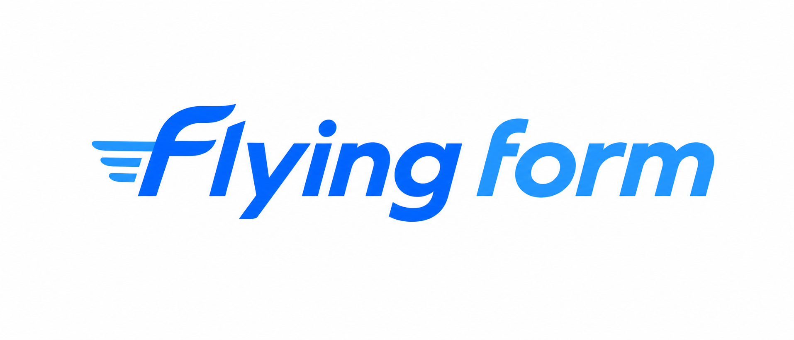
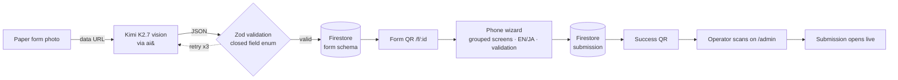

<div align="center">



**Photograph a paper form; get a working, validated, bilingual mobile form in seconds.**

The visitor scans a QR and fills it on their phone, with the right **form widget** per field on mobile — date picker, phone keypad, checkboxes, dropdowns. The enterprise scans the visitor's success QR back and the exact submission opens on the dashboard. Every model call runs on Kimi K2.7 via ai& inference, in Japan.

[](./LICENSE)


**[Live demo → flying-form-9f6b3.web.app](https://flying-form-9f6b3.web.app)** &nbsp;·&nbsp; open `/admin` to create a form, `/f/:formId` to fill one

**[Slide deck →](https://flying-form-9f6b3.web.app/deck.html)** ([source](./deck/flying-form-deck.html))

Built for the **ai& × Moonshot Tokyo Hackathon Night**: Enterprise Workflow / AI Agent track.

[Kimi × ai&](#powered-by-kimi-k27-on-ai) &nbsp;·&nbsp; [Problem](#the-problem) &nbsp;·&nbsp; [What it does](#what-it-does) &nbsp;·&nbsp; [Demo](#demo) &nbsp;·&nbsp; [How it works](#how-it-works) &nbsp;·&nbsp; [Run it](#run-it) &nbsp;·&nbsp; [Status](#status) &nbsp;·&nbsp; [Security](#demo-scope--security)

</div>

---

## Powered by Kimi K2.7, on ai&

> [!IMPORTANT]
> **Every model call in Flying Form is Kimi K2.7, served on [ai&](https://www.aiand.com) inference in Japan. No other model is ever called.** This is the qualification gate for the event, and it is also the product thesis: personal data on the form is processed on Japan-based inference, never shipped to a foreign API.

| Kimi call | Modality | What it does |
|:--|:--|:--|
| **Schema generation** | 🖼️ vision | Reads a photo of a paper form and returns a validated, bilingual field schema. |
| **Prefill** *(scaffolded)* | 🖼️ vision | Reads a filled paper copy and maps handwritten values to field ids. |

The browser never talks to ai& directly (the endpoint has no CORS). A thin Firebase Cloud Function in `asia-northeast1` ([`app/functions/index.js`](./app/functions/index.js)) proxies every request to `moonshotai/kimi-k2.7` server-side. The language toggle needs no call at all: both `label_en` and `label_ja` ship inside the schema Kimi generates. See [`app/src/lib/kimi.ts`](./app/src/lib/kimi.ts).

## The problem

Japanese enterprises (property, facilities, clinics, city offices) still run intake on paper. Someone photographs, re-keys, and files each sheet by hand. Building a digital equivalent normally costs a developer days per form, so most forms never get digitized.

Paper also excludes people. A Japanese-only sheet is unusable to the foreign residents and visitors across Tokyo, invisible to a screen reader, and hard for anyone with low vision or a motor barrier. Digitizing the form is not only an efficiency win; it is what makes the form accessible at all.

## What it does

You point a phone at a paper form. Ten seconds later you have a real mobile form: the right input type per field, inline validation, an English/Japanese toggle, and a shareable QR. A visitor scans it, fills a clean grouped-screen wizard, and submits. Their phone shows a success QR. You scan that QR at the desk and their submission opens live.

> **No field setup. No schema editor. One photo in, one working form out.**

## Demo

> [!NOTE]
> The value beat lands in about ten seconds: paper photo in, validated mobile form out. Try it live at **[flying-form-9f6b3.web.app](https://flying-form-9f6b3.web.app)**.

| # | On stage | What the room sees |
|:-:|:--|:--|
| 1 | Operator shoots a paper form on the dashboard | Kimi reads it; a validated mobile form and QR render in ~10s |
| 2 | A judge scans the QR and fills the wizard | Grouped screens, flipped to English mid-way |
| 3 | The judge submits | A success QR appears on their phone |
| 4 | Operator scans that QR on the dashboard | The exact submission opens in the table, live |

Two real Japanese forms live in [`sample-forms/`](./sample-forms) if you want to try the generator without your own paper.

## How it works



One JSON object flows through the whole system. Structure is separate from values, so the schema is generated once and every submission is just a `values` map keyed by field id.

For the full tech stack laid out tier by tier, open the interactive diagram: [`app/public/architecture.html`](./app/public/architecture.html) (served live at [flying-form-9f6b3.web.app/architecture.html](https://flying-form-9f6b3.web.app/architecture.html) after deploy).

### Four things that hold it together

| | Guarantee | How |
|:-:|:--|:--|
| 🔒 | **Safe by construction** | Kimi can only emit nine field types (`text` `email` `tel` `number` `date` `select` `radio` `checkbox` `textarea`). Output is fence-stripped, `JSON.parse`d in a try/catch, and Zod-validated before render; bad output is rejected and retried up to 3×. A bad photo cannot produce a broken form. See [`types.ts`](./app/src/lib/types.ts). |
| 🗾 | **Sovereign** | Vision and text both run on Kimi K2.7 on ai& inference, hosted in Japan. The browser never calls a foreign model API; a thin Cloud Function ([`index.js`](./app/functions/index.js)) proxies to ai& server-side. Personal data is processed on Japan-based inference, not shipped abroad. |
| 🌐 | **Bilingual by default** | Kimi emits `label_en` and `label_ja` for every title, section, field, and option at generation time. The toggle flips the whole form instantly, with no extra call and no lost values. |
| ♿ | **Accessible** | Native controls, associated `<label>`s, a semantic `progressbar`, an `aria-current` stepper, visible focus, and adequate contrast and tap targets. A screen reader can navigate it; a photo of paper cannot be navigated at all. |

## Run it

> [!TIP]
> **Prerequisites:** Node 22+, a Firebase project (Hosting + Firestore), and the ai& Cloud Function deployed.

```bash
cd app
npm install
npm run dev          # http://localhost:5173, /api/kimi proxied to the deployed function
```

Open `/admin` to create a form, or `/f/:formId` to fill one.

Firebase config lives in [`app/.env`](./app/.env) as `VITE_FB_*` variables. In dev, [`vite.config.ts`](./app/vite.config.ts) proxies `/api/kimi` to the deployed Cloud Function; in production a Firebase Hosting rewrite points the same path at it.

**Build and deploy:**

```bash
cd app
npm run build        # tsc -b && vite build
firebase deploy      # hosting + the kimi function + Firestore rules
```

## Project structure

```
flying-form/
├── app/                        # the product — a single Vite + React 19 SPA
│   ├── src/
│   │   ├── pages/              # Admin, AdminNew, AdminFormDetail, Fill
│   │   ├── components/         # AdminShell, FormPreview, FieldInput, ShareQR, ScanModal
│   │   └── lib/
│   │       ├── kimi.ts         # ai& calls: schema generation + prefill
│   │       ├── types.ts        # schema, Zod validation, defensive parse
│   │       ├── fb.ts           # Firestore: forms + submissions
│   │       ├── lang.tsx        # EN/JA context
│   │       └── i18n.ts         # UI-chrome strings
│   ├── functions/index.js      # ai& proxy Cloud Function (the deployed one)
│   └── firebase.json           # hosting rewrites, Firestore config
├── sample-forms/               # two real Japanese forms to test the generator
├── PRODUCT.md                  # product brief, positioning, design principles
└── flying-form-prd.md          # full PRD: requirements, data schema, demo script
```

## Tech stack

| Layer | Choice |
|---|---|
| Frontend | React 19, React Router 7, Vite 8, TypeScript 6 |
| AI | Kimi K2.7 on ai& inference (vision + text), the only model |
| Validation | Zod 4 against a closed field-type enum |
| Store | Cloud Firestore (forms + per-form submission subcollections, live listeners) |
| Proxy | Firebase Cloud Function in `asia-northeast1` |
| QR | `qrcode.react` for generation, `html5-qrcode` for scanning |
| Type | IBM Plex Sans JP, Shippori Mincho, IBM Plex Mono |

## Status

**✅ Shipped (P0)** — the full round trip works end to end:

- Photo → Kimi vision → validated schema, retried on bad output
- Publish → form URL + QR, with a read-only preview before publishing
- Phone-first grouped wizard: one screen per section, progress bar, back/next, per-section required-field validation
- English/Japanese toggle across the whole fill flow
- Submit → success QR
- Operator scans the success QR on the dashboard and that submission opens
- Live submissions table with per-form counts

**🚧 Scaffolded, not wired into the UI:**

- Photo prefill (`prefillValues` in [`kimi.ts`](./app/src/lib/kimi.ts)): photograph a filled paper copy and map values by field id. The call exists; no screen invokes it yet.

**⏸️ Parked (design-compatible, not built):** conversational fill, voice fill, WebMCP actuation, pre-submit completeness checks. See the [PRD](./flying-form-prd.md) for the full P1/P2 breakdown.

## Demo scope & security

> [!WARNING]
> This is a hackathon prototype. Do not run it as-is with real personal data until auth, secrets management, and Firestore rules are hardened. The items below are deliberate scoping decisions, not oversights.

| Area | Decision |
|:--|:--|
| **Authentication** | None. Every route, including the dashboard, is public: anyone with a URL or QR can open it. Access control and tenancy are post-MVP. |
| **API key** | The ai& key is committed inline in [`app/functions/index.js`](./app/functions/index.js) as a throwaway key scoped to the event. Rotate or revoke it before any real deployment and move it to a secret manager. |
| **Firestore rules** | [`app/firestore.rules`](./app/firestore.rules) allow open read/write until a hard expiry date: fine for a demo, unsafe for production. |

## Design docs

- [`app/public/architecture.html`](./app/public/architecture.html): interactive technical architecture and full tech-stack diagram
- [`PRODUCT.md`](./PRODUCT.md): positioning, brand, and design principles
- [`flying-form-prd.md`](./flying-form-prd.md): full PRD, including requirements, data schema, Kimi prompts, and the demo script

<div align="center">

**[MIT](./LICENSE)** © 2026 Wei He &nbsp;·&nbsp; Built on [Kimi K2.7](https://www.moonshot.ai) via [ai&](https://www.aiand.com)

</div>
